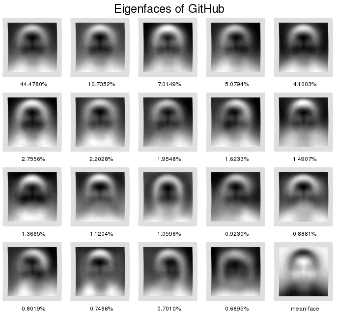

# Humans of GitHub (HoG)

## Introduction

This repository is an entry to the [Third Annual GitHub Data
Challenge](https://github.com/blog/1864-third-annual-github-data-challenge).

We use the GitHub [Users API](https://developer.github.com/v3/users/) in order
to acquire a large collection of user avatars. User avatars! A pointed
expression of individualism; A mirror into the users' soul. We then use
dimensionality reduction techniques in order to explore if there are any
similarities or re-occurring patterns in the user avatars, thus answering the
eternal question of *Who really uses GitHub?* Who are the Humans of GitHub? Cats
with eight tentacles?  Unicorns? Ninjas? This visualization finally brings
answers!

## Visualization

[Eigenfaces](http://jeremykun.com/2011/07/27/eigenfaces/) are a straight-forward
and highly interpretable way to find structure and patterns in large collections
of images.  So that's the technique we are going to use to explore the "Humans
of GitHub." The following figure shows the results of using Principal Component
Analysis to find 20 eigenfaces in our data-set of GitHub user-avatars. Every
eigenface is tagged with the percentage of variance it explains.

We can learn a number of things from this visualization:

- **GitHub is used by humans!** The eigenface in the top-left corner of the
  visualization is the most important eigenface in the plot: it accounts for
  most of the variance in the data-set. The eigenface has a distinctly humanoid
  complexion so we can rest assured in the knowledge that GitHub is indeed for
  humans.

- **GitHub users have funky (facial-)hair!** The second-most important eigenface
  complements the previously mentioned strongest eigenface nicely. If we
  interpret the strongest eigenface to capture the variance in human appearance
  of GitHub users, the second-strongest eigenface captures the variance in
  things that are around the heads of GitHub users (i.e. their hair) and we can
  interpret the patterned noise in the second-strongest eigenface as an
  expression of the variety of GitHub users hair-dos. Similarly, the sixth
  strongest eigenface can be interpreted as capturing those GitHub users who
  have a beard.

- **GitHub users like geometry!** The fourth, fifth, ninth and thirteenth most
  important eigenfaces exhibit very regular patterns that don't look humanoid at
  all. These eigenfaces can be interpreted as capturing those GitHub users who
  use a logo or some sort of gemoetric shape for their avatar.

The data-set we used to create this visualization violates a number of key
assumptions of the usual eigenface inference process: the images in the data-set
are not controlled for lighting conditions and the images are not centered on a
common position of mouth, eyes and nose. It is interesting how we can
nevertheless still find somewhat interpretable and most certainly entertaining
results. This speaks to the robustness of eigenfaces and principal component
analysis.

You can find full detail on how we went about creating the eigenfaces for our
visualization in the sections below.

## Technical detail

We need to do four simple things to get GitHub user eigenfaces (detailed in the
four sections below).

### Data acquisition

Before we get started, we first need to do some admin work. You'll want to
create an [OAuth
Token](https://help.github.com/articles/creating-an-access-token-for-command-line-use)
and copy it into a file named *oauth.txt* in the top-level directory of this
repository. Then, have a peek around the scripts in the *hog/* directory (no,
nothing to do with pigs - that's short for "Humans of GitHub," you silly).
There are some configuration options at the top of each script that you'll want
to review and adapt if you deem it necessary.

Now we're ready to rock and create some eigenfaces!

We crawl the /users API and grab some meta-data about people on GitHub.  Amongst
others, this meta-data contains a link to every user's avatar that we'll use to
get some image data in a minute. The following snippet downloads 5000 batches of
JSON user information (starting from the first) from the API and stores them
gzipped on disk at *data/users*. Every batch contains information about 100
users, so this will give us a sizeable data-set to work with.

`./hog/crawl_users.sh 0 5000`

We then use the previously acquired meta-information to collect a large number
of avatars of GitHub users. The following snippet retrieves the avatar of ever
user we queried from the API and stores it at *data/avatars*.

`./hog/crawl_avatars.py data/users/*.json.gz`

### Data pre-processing and cleanup

Next up, we apply some preprocessing to make sure that all avatars are roughly
comparable. The following snippet converts all avatars to PNG, rescales them to
100x100 pixels and converts them to gray-scale. The first operation really just
is convenience to not have to deal with multiple image formats later.  The later
two operations make the rest of the eigenface inference problem more tractable
by reducing the dimensionality of our data-set. The script also filters out any
GitHub auto-generated avatars. Note: the avatars are edited in-place i.e. the
original full-size and full-color avatars are removed in favor of their new
low-pixel gray-scale versions.

`./hog/preprocess_avatars.sh data/avatars/*`

### Principal component analysis

Finally, we can use Principal Component Analysis to perform eigenface
decomposition! The following snippet loads every 100x100 image in our data-set
as a 10000x1-dimensional vector, bunches them together into a matrix and applies
PCA. The top-50 principal components are then unrolled into images and output to
*data/eigenfaces*. The eigenfaces adhere to the following naming convention:
*eigenface#0.[0-9]+#.png* where the numbers indicate the percentage of variance
explained by the principal component corresponding to the eigenface.

`./hog/eigenfaces.py data/avatars/*.png`

## A note on "big data"

We downloaded 20125 avatars in total for our experiments. 9953 (49%) of these
avatars were auto-generated and thus filtered out, leaving 10172 avatars left
over. Due to computing equipment constraints, we unfortunately had to reduce
this data-set further: we used a random selection of 8000 avatars from our
data-set to create the final eigenface decomposition visualization. (Doing
data-science on a Samsung Chromebook... It's not fun.) However, the eigenfaces
our approach managed to infer looked fairly stable past a data-set size of about
1000 avatars, so we are confident that the results we present in the
visualization above are representative of the entire population of GitHub
user-avatars.

## Dependencies

- Python 2.7: sklearn, skimage, numpy, requests
- cURL
- ImageMagick
- GNUplot
